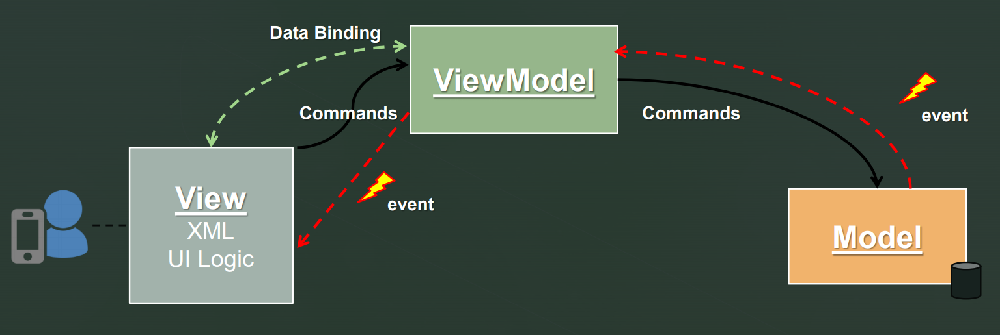
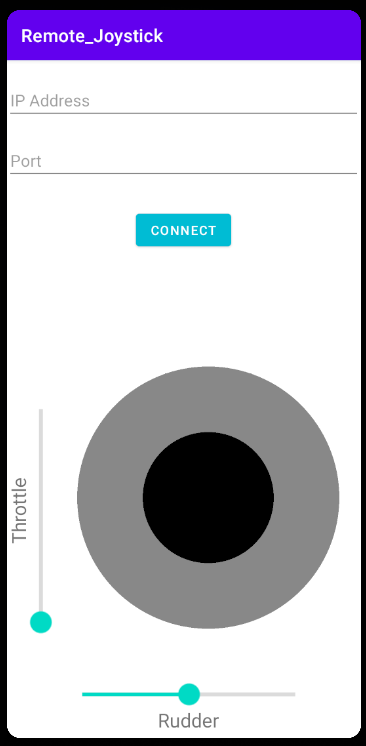
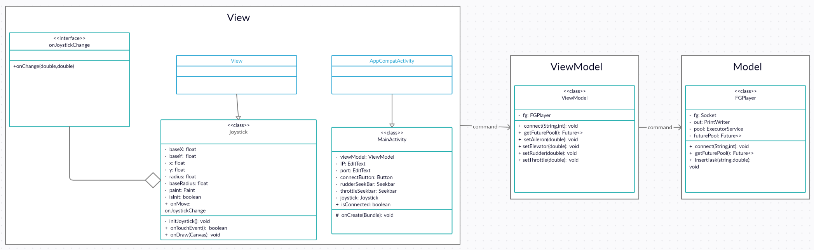

# Advanced Programming 2 - Remote Joystick Android App

### Video
[Link](https://www.youtube.com/watch?v=yg5fKyuen-A)
### Presentation
[Link](https://docs.google.com/presentation/d/1dNqXR-WDkC7wD7cAM686fICon1QRNp4byhB73whBs04/edit?usp=sharing)

## Installation
1. Clone the project and open it in Android studio.  
2. Click the run button or shift+f10 and the emulator will come up with the app running.  
3. Download and open FlightGear, in the ```Settings``` under ```Additional Settings``` type the following:  
**--telnet=socket,in,10,127.0.0.1,6400,tcp**  
4. Click on ```Fly!```, click on ```Cessna -> Autostart``` and go back to the emulator.  
5. type your IP address in the IP field and 6400 in the Port field and click on the connect button, now you are connected to the FlightGear and can control the plane as you please.

## Description
The App is using a given IP address and Port to log to the FlightGear server, then the user can control the plane using the seekbars and the joystick.
The App is implements the MVVM design pattern, when the user connects to the server, move the seebarks or the joystick the View 
requests the ViewModel to change the values accordingly and the ViewModel passes the requests to the Model.



#### features
The app has a field for the IP address of the server, field for the Port, connect button to connect the FlightGear server with the given IP and Port,  
a seekbar to control the rudder, a seekbar to control the throttle and the joystick that controls the aileron and the elevator.



## Directories
in ```Remote_Joystick/app/src/main/java/com/example/remote_joystick/``` there are the 3 main files:
View - contains the front-end part of the app.
ViewModel - contains the ViewModel which gets the View's requests and sends them to the Model.
Model - Contains the back-end part of the app, changes the values in FlightGear according to it's given instructions.

### UML

